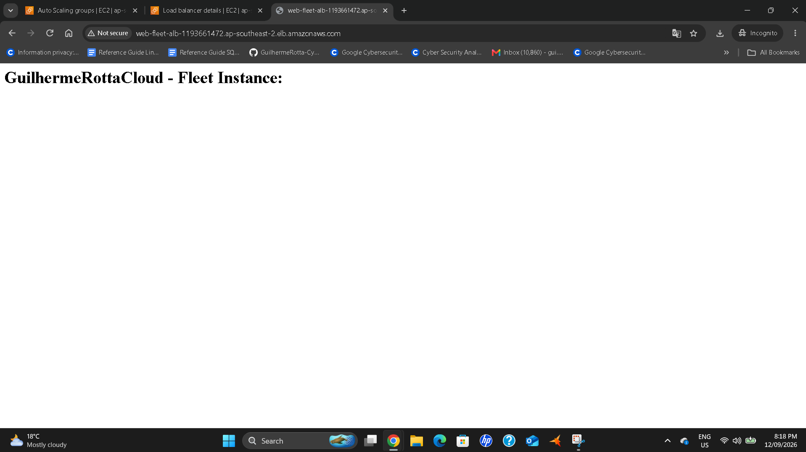
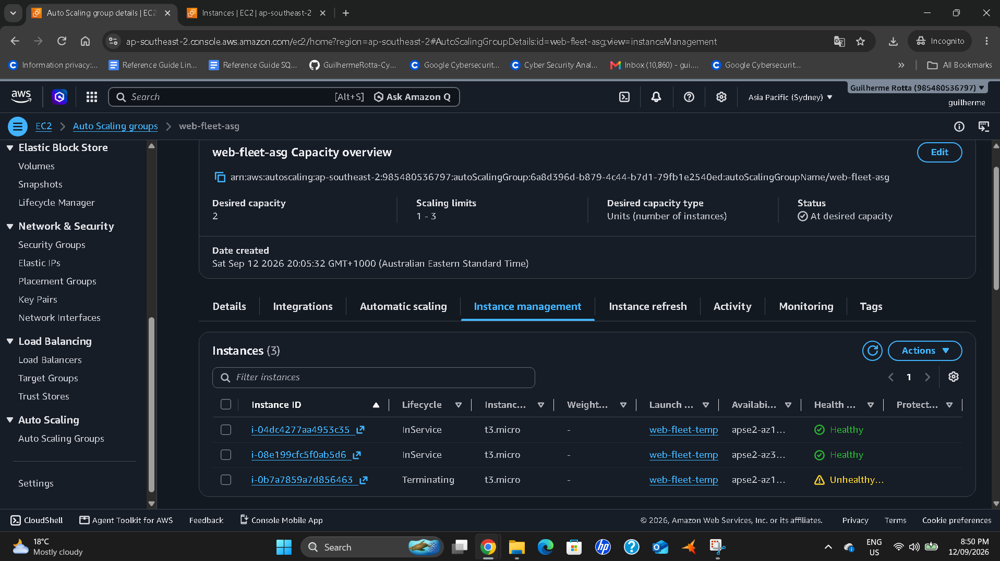

# AWS Highly Available & Fault-Tolerant Web Fleet

## 📌 Project Overview
This project demonstrates the deployment of a highly available, fault-tolerant, and secure web server infrastructure on AWS. Utilizing an **Application Load Balancer (ALB)** and an **Auto Scaling Group (ASG)**, the architecture automatically scales compute resources up or down based on traffic demands, ensuring zero downtime and resilient failover capabilities across multiple Availability Zones in the Sydney region (`ap-southeast-2`).

---

## 🛠️ Architecture Components
* **Compute & Automation:** EC2 Instances deployed via an automated Bash bootstrap script within an Auto Scaling Group.
* **Traffic Management:** Application Load Balancer routing public internet traffic (Port 80) across distributed targets.
* **Security Layer:** Strictly decoupled Security Groups protecting ingress/egress network borders.
* **High Availability Bounds:** Group boundaries enforced with Minimum: 1, Desired: 2, and Maximum: 3 compute nodes.

---

## 📸 Production Evidence & Validation

### 1️⃣ Public Accessibility via Application Load Balancer
The screenshot below proves the architecture is fully public and active. Ingress HTTP requests hitting the persistent public DNS link of the AWS Application Load Balancer are successfully decrypted, evaluated, and forwarded to the operational Apache web servers on the backend.

---

### 2️⃣ Automated Self-Healing & Failover Verification
To validate the resilient nature of Section 8 architecture, a manual node termination was executed to trigger an artificial infrastructure crash. As documented below, the AWS Auto Scaling control loops immediately detected the capacity deficit, isolated the faulty instance as **Unhealthy/Terminating**, and autonomously provisioned a fresh replacement node back into **InService** state to cure the cluster with zero manual intervention.

---

## 🚀 Key Takeaways & Learned Skills
* **FinOps Governance:** Implementing precise decommissioning procedures to mitigate idle cloud waste.
* **Infrastructure Resilience:** Hardening infrastructure bounds against regional data center dropouts.
* **Automation Engineering:** Using instance metadata token protocols (IMDSv2) for dynamic environment bootstrapping.
